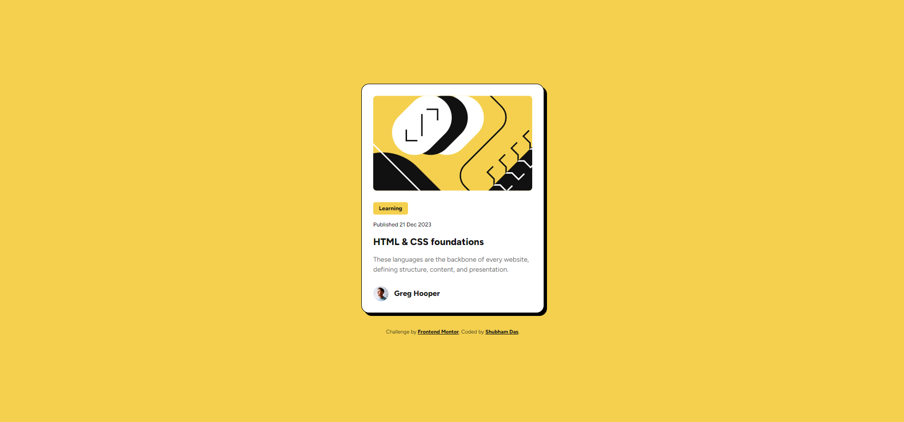
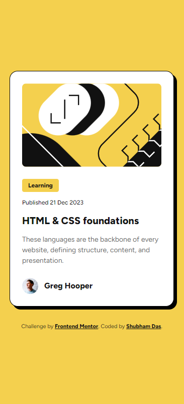

# Frontend Mentor - Blog preview card

## Desktop Final Output👇 [Link 🔗](https://shubham-blog-card.netlify.app/)

## Mobile Final Output👇

## Welcome! 👋

🧑‍💻My name is Shubham Das.

Thanks for checking out my solution to this front-end coding challenge.

## My process 💡

### Built with 🛠️

- Semantic HTML5 markup
- CSS custom properties
- Flexbox
- CSS Grid
- Mobile-first workflow

### Have a Great Day/Night.🤗
